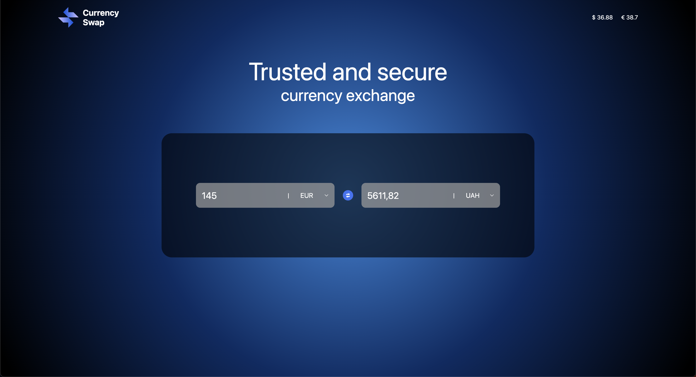

# Currency Converter
The **Currency Converter** project is created according to the assignment from **ITOP1000** company.
<br>
<br>



### 🔗 **Live preview** of the project is [here]().

## **Features**
* Ability con convert 3 currencies: USD, EUR, UAH.
* Ability to type in any input and convert the value according to the stated currencies.

## **Outcome**
* Used **TypeScript**
* Used **Angular**
* Used **SCSS**
* Studied Angular way of building apps
* Studied Angular folder structure
* Learned how to work with APIs

## **Getting Started**
```
HTTPS - git clone https://github.com/alex-dishen/currency-converter.git

SSH - git clone git@github.com:alex-dishen/currency-converter.git

cd currency-converter

npm install

ng serve --open
```